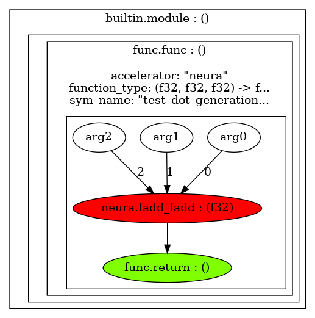

# MLIR Code Visualization Guide

This guide explains how to visualize MLIR (Multi-Level Intermediate Representation) code using various tools and techniques.

## Usage

First, run `apt install graphviz` to install Graphviz. For an MLIR file, use the option `--view-op-graph` to generate a Graphviz visualization of a function. Then, use the `dot` command to create an image file from the visualization.

Example:

```bash
mlir-neura-opt --assign-accelerator --lower-arith-to-neura --fuse-pattern --view-op-graph test.mlir 2> test.dot 
dot -Tpng test.dot -o test.png
```

It will generate a `test.png` file in the current directory, as shown below:



If there are multiple graphs in one dot file, you can use the option `-O` to generate multiple DFGs from one dot file.

Example:

```bash
dot -Tpng test.dot -O
```

It will generate `test.dot.png`, `test.dot.1.png`, `test.dot.2.png`, etc.